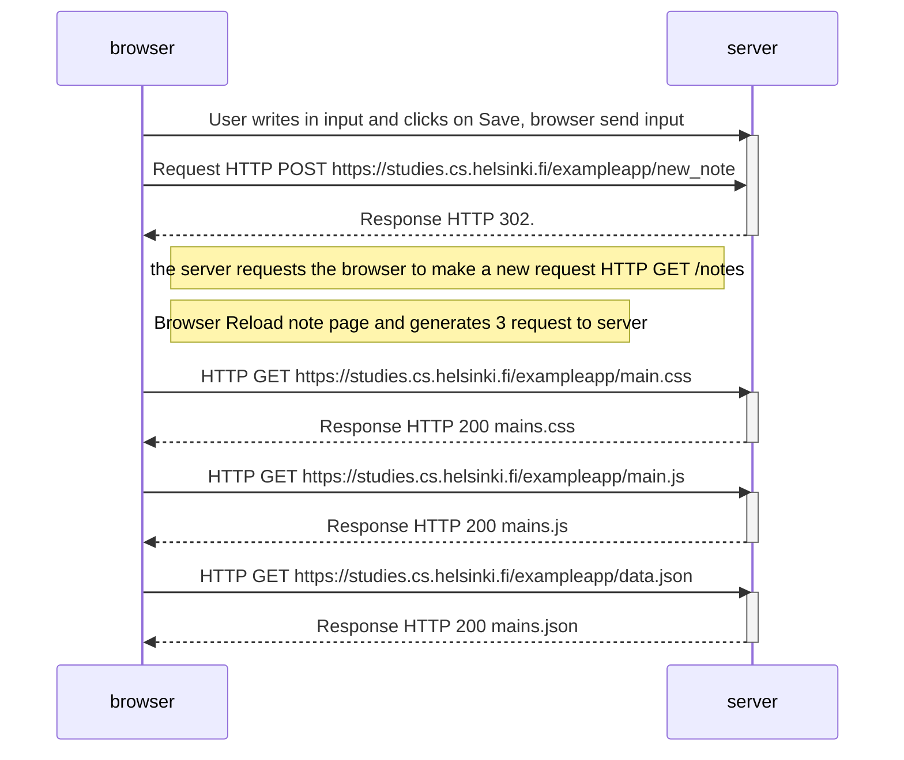

```mermaid
    sequenceDiagram
        participant browser
        participant server

        browser->>server: User writes in input and clicks on Save, browser send input
        activate server


        browser->>server: Request HTTP POST https://studies.cs.helsinki.fi/exampleapp/new_note
        server-->>browser: Response HTTP 302.
        deactivate server


        Note left of server: the server requests the browser to make a new request  HTTP GET /notes
        Note right of browser: Browser Reload note page and generates 3 request to server

        browser->>server: HTTP GET https://studies.cs.helsinki.fi/exampleapp/main.css
        activate server
        server-->>browser: Response HTTP 200 mains.css
        deactivate server

        browser->>server: HTTP GET https://studies.cs.helsinki.fi/exampleapp/main.js
        activate server
        server-->>browser: Response HTTP 200 mains.js
        deactivate server

        browser->>server: HTTP GET https://studies.cs.helsinki.fi/exampleapp/data.json
        activate server
        server-->>browser: Response HTTP 200 mains.json
        deactivate server

```
