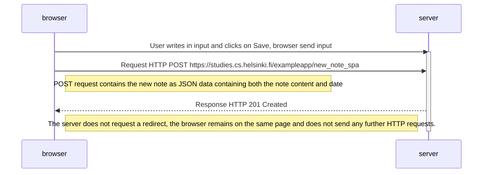

```mermaid  
    sequenceDiagram
        participant browser
        participant server

        browser->>server: User writes in input and clicks on Save, browser send input
        activate server


        browser->>server: Request HTTP POST https://studies.cs.helsinki.fi/exampleapp/new_note_spa
        Note right of browser:  POST request contains the new note as JSON data containing both the note content and date
        server-->>browser: Response HTTP 201 Created
        Note left of server: The server does not request a redirect, the browser remains on the same page and does not send any further HTTP requests.
        deactivate server
```